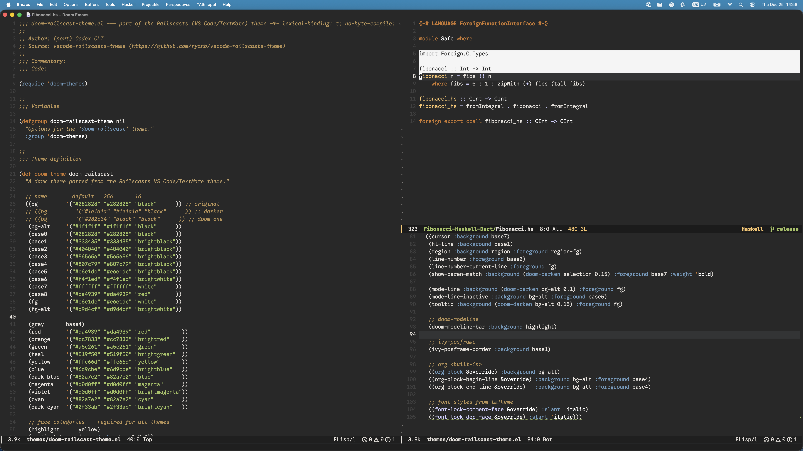
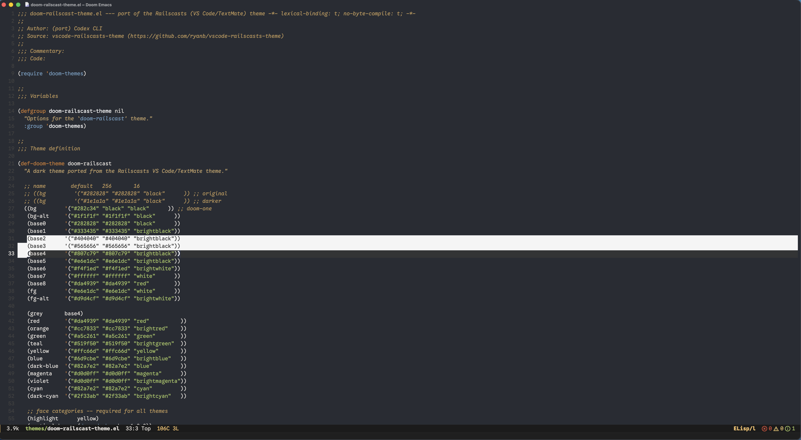
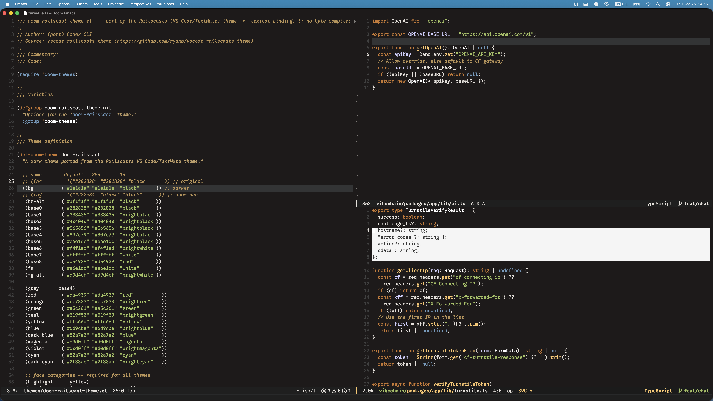

# Doom Railscasts Theme

A port of the Railscasts theme (VS Code/TextMate) for Doom Emacs.

This exists because I’m coming back to Emacs after spending time in VS Code and Zed, and I’ve been using Railscasts for 15+ years — I like it, I’m used to it, and I wanted the same vibe in Doom. Also, @mahmodiums was the first person to show me this wonderful theme.

Source inspiration: `vscode-railscasts-theme` (https://github.com/ryanb/vscode-railscasts-theme)

## Variants

This repo includes three variants that only differ by background color:

- `doom-railscasts` — classic Railscasts-ish background (`#282828`)
- `doom-railscasts-one` — Doom One-style background (`#282c34`)
- `doom-railscasts-darker` — darker background (`#1e1a1a`)

## Screenshots

- `doom-railscasts`
  - 
- `doom-railscasts-one`
  - 
- `doom-railscasts-darker`
  - 

## Installation (Doom Emacs)

1. Create your themes directory (if it doesn’t exist):

   ```sh
   mkdir -p ~/.doom.d/themes  # a.k.a. $DOOMDIR/themes
   ```

2. Copy the theme files into it:

   ```sh
   cp *.el ~/.doom.d/themes/
   ```

3. Activate the theme in `config.el`:

   ```elisp
   ;; If you already use ~/.doom.d/themes, Doom will find these automatically.
   ;; Otherwise, uncomment this:
   ;; (add-to-list 'custom-theme-load-path (expand-file-name "themes/" doom-user-dir))

   (setq doom-theme 'doom-railscasts) ; or 'doom-railscasts-one / 'doom-railscasts-darker
   ```

4. Sync and restart:

   ```sh
   doom sync
   ```

## Font

The theme is designed with **Google Sans Code** in mind:

- [https://github.com/googlefonts/googlesanscode](https://github.com/googlefonts/googlesans-code)

Optional Doom config:

```elisp
(setq doom-font (font-spec :family "Google Sans Code" :size 17.5))
```
